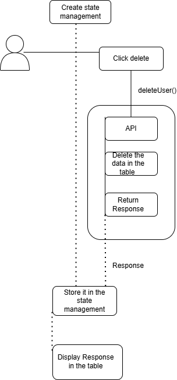

# Details

```http
   User can delete the existing data in the table
```

#### Click delete button
```javascript
              <td>
                <button
                  className="select-button"
                  onClick={() => deleteUser(user.id)}
                >
                  Delete
                </button>
              </td>
```

#### In deleteUser call API

```javascript
  DELETE:-user/id
```
#### Delete the field in the table
 
### Flow chart





