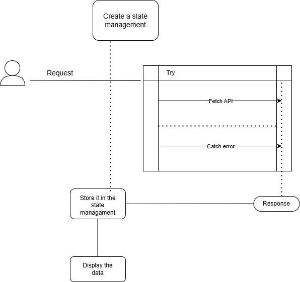

# Details

```http
  GET/getuser
```

# Import Link from react-router-dom
To use `react-router-dom`, install the package by the way `npm i react-router-dom`

# Create a Button in jsx 
Use the `Link` to navigate to another path by clicking `Display` button. 
```javascript
<Link to ="/getuser"><button>To Display data </button></Link>
```

# Create a Component
To Display the data from the `API`

# Method 
```http
GET:-user
```
Create a state management to store the response from the API.

```javascript
const[datas,setDatas]=useState('');
```
# Axios

To use axios first we install `npm i axios` and import the axios from `axios`
```javacsript
 const result = await axios.get("http://localhost/getuser")
                console.log(result.data);
                setDatas(result.data)
```

# Display the data from the API

Display the `state management` which has stored the data from the `API`

```javascript
return (
        <div >
            {datas && <p> {datas}</p>}
        </div>
    );
```
# Output
```javascript
[{"Id":"5e33De3eaD3n",
"FirstName":"vishali",
"LastName":"valliyappan",
"EmailAddress":"vishalivalliyappan@gmail.com",
"Signinthrough":"google",
"CreatedAt":"2024-07-08T18:43:30+05:30",
"TimeZone":"America/New_York",
"IsActive":true,
"Country":"india"}]
```
# Flow Chart

