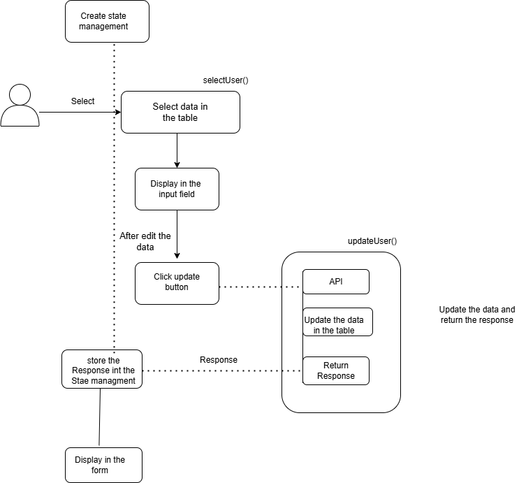

# Details

```http
   User can edit the existing data in the table
```

| Parameter | Type     | Description                |
| :-------- | :------- | :------------------------- |
| `firstname` | `string` | Required.String/Numeric |
| `lastname` | `string`| Required.String/Numeric |
| `emailaddress` | `string` | Reqired.Valid Email address |
| `signinthrough` | `string`| Required.String |
| `timezone`|`string`|Required.String |
|`country`|`string`|Required.String |

#### Click select button
```javascript
              <td>
                <button
                  className="select-button"
                  onClick={() => selectUser(user.id)}
                >
                  Delete
                </button>
              </td>

```
#### In selectUser call API 
```javascript
  PATCH:-user/id
```

#### Headers
Yet to be updated

#### A Few things to remember

#### Validation

#### Input

```json
  {
  "firstname" : "vishali",
  "lastname" : "valliyappan",
  "emailaddress" : "vishlai.v@atomedgesoft.com",
  "signinthrough" : "Google",
  "timezone": "Asia/Calcuta",
  "country" : "india"
}
``` 
### Flow chart





